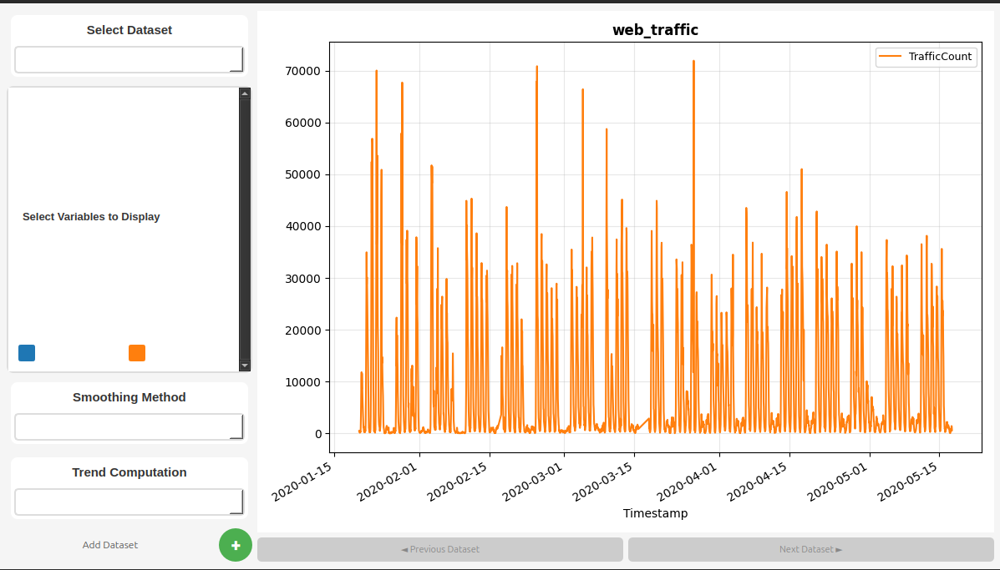
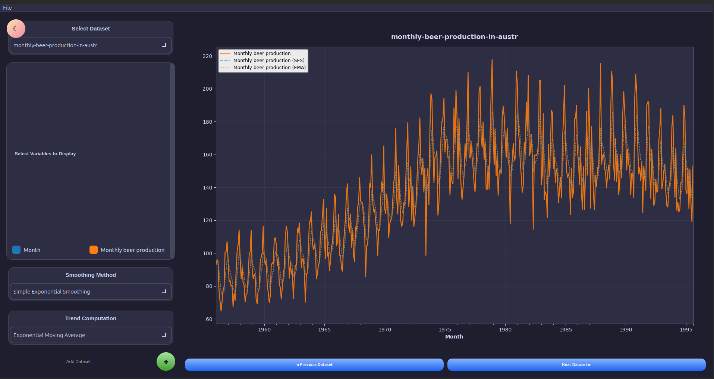

# 📊 Statistics Visualization Tool

<div align="center">


**A beautiful, modern desktop application for time series data visualization and statistical analysis**

[Features](#-features) • [Installation](#-installation) • [Usage](#-usage) • [Screenshots](#-screenshots) • [Contributing](#-contributing)

</div>

---

## ✨ Features

### 🎨 **Modern UI Design**

- **Light & Dark Themes** - Beautiful theme switcher with smooth transitions
- **Rounded Elements** - Modern, card-based design with smooth corners
- **Gradient Buttons** - Eye-catching buttons with hover animations
- **Responsive Layout** - Adapts to different screen sizes

### 📈 **Powerful Visualization**

- **Multiple Dataset Support** - Load and compare multiple CSV files
- **Interactive Checkboxes** - Toggle visibility of individual data series
- **Color-Coded Series** - Automatic color assignment for easy identification
- **Smooth Animations** - Hover effects and transitions

### 🔧 **Statistical Analysis**

- **Smoothing Methods**
  - Simple Exponential Smoothing (SES)
  - Double Exponential Smoothing (DES)
- **Trend Computation**
  - Simple Moving Average (SMA)
  - Exponential Moving Average (EMA)

### 💾 **Data Management**

- **Multi-File Import** - Load multiple CSV files at once
- **Export Plots** - Save visualizations in PNG, JPG, PDF, or SVG formats
- **Dataset Navigation** - Easily switch between loaded datasets
- **Smart Naming** - Automatic handling of duplicate dataset names

---

## 🚀 Installation

### Prerequisites

- Python 3.8 or higher
- pip package manager

### Setup

1. **Clone the repository**

```bash
git clone https://github.com/gedeontiga/time-series-app.git
cd stats-visualization-tool
```

2. **Install dependencies**

```bash
pip install -r requirements.txt
```

3. **Run the application**

```bash
python main.py
```

---

## 📖 Usage

### Quick Start

1. **Launch the application**

   ```bash
   python main.py
   ```

2. **Load your data**

   - Click the green **"+"** button
   - Select one or more CSV files
   - The first column should be timestamps/dates

3. **Customize your view**

   - Use checkboxes to show/hide data series
   - Select smoothing methods from the dropdown
   - Choose trend computation methods

4. **Export your visualization**
   - Go to **File → Export Plot**
   - Choose your preferred format (PNG, JPG, PDF, SVG)

### Data Format

Your CSV files should follow this structure:

```csv
Timestamp,Series1,Series2,Series3
2020-01-01,1000,2000,1500
2020-01-02,1100,2100,1600
2020-01-03,1050,2050,1550
...
```

- **First column**: Timestamps (will be auto-converted to datetime)
- **Other columns**: Numeric data series

### Keyboard Shortcuts

| Shortcut | Action                           |
| -------- | -------------------------------- |
| `Ctrl+O` | Open file dialog _(coming soon)_ |
| `Ctrl+E` | Export plot _(coming soon)_      |
| `Ctrl+T` | Toggle theme _(coming soon)_     |

---

## 🖼️ Screenshots

### Light Theme


_Clean, professional interface with warm accents_

### Dark Theme


_Modern dark mode with excellent contrast_

---

## 🎯 Key Components

### Main Window

- **Left Panel**: Dataset selection, variable checkboxes, analysis options
- **Right Panel**: Interactive matplotlib canvas for visualization
- **Floating Button**: Theme switcher (☀/☾)
- **Navigation Buttons**: Switch between datasets

### Smoothing Methods

#### Simple Exponential Smoothing (SES)

Applies exponential smoothing with span=5 to reduce noise while preserving trends.

```python
y_smoothed = df[column].ewm(span=5, adjust=False).mean()
```

#### Double Exponential Smoothing (DES)

Applies two-pass exponential smoothing for even smoother curves.

```python
y_smoothed = df[column].ewm(span=5, adjust=False).mean().ewm(span=5, adjust=False).mean()
```

### Trend Methods

#### Simple Moving Average (SMA)

Rolling window average centered on each point.

```python
trend = df[column].rolling(window=5, center=True).mean()
```

#### Exponential Moving Average (EMA)

Weighted moving average giving more importance to recent values.

```python
trend = df[column].ewm(span=5, adjust=False).mean()
```

---

## 🛠️ Configuration

### Customizing Colors

The application uses matplotlib's `tab10` colormap by default. To customize:

```python
def getColor(self, idx):
    # Use your preferred colormap
    colors = plt.cm.viridis.colors  # or 'plasma', 'cool', etc.
    return colors[idx % len(colors)]
```

### Adjusting Smoothing Parameters

Modify the `span` parameter in smoothing methods:

```python
# More smoothing (higher span)
y = df[column].ewm(span=10, adjust=False).mean()

# Less smoothing (lower span)
y = df[column].ewm(span=3, adjust=False).mean()
```

---

## 🤝 Contributing

Contributions are welcome! Here's how you can help:

1. **Fork the repository**
2. **Create a feature branch**
   ```bash
   git checkout -b feature/amazing-feature
   ```
3. **Commit your changes**
   ```bash
   git commit -m 'Add amazing feature'
   ```
4. **Push to the branch**
   ```bash
   git push origin feature/amazing-feature
   ```
5. **Open a Pull Request**

### Development Setup

```bash
# Clone your fork
git clone https://github.com/gedeontiga/time-series-app.git

# Install development dependencies
pip install -r requirements-dev.txt

# Run tests (if available)
pytest tests/
```

---

## 📝 Roadmap

- [ ] **v2.0**

  - [ ] Add statistical tests (t-test, ANOVA, etc.)
  - [ ] Support for more file formats (Excel, JSON)
  - [ ] Custom color scheme editor
  - [ ] Keyboard shortcuts
  - [ ] Data preprocessing tools

- [ ] **v2.1**

  - [ ] Real-time data streaming
  - [ ] Multiple plot types (scatter, bar, box)
  - [ ] Data export functionality
  - [ ] Plugin system

- [ ] **v2.2**
  - [ ] Machine learning integration
  - [ ] Collaborative features
  - [ ] Cloud storage integration

---

## 📄 License

This project is licensed under the MIT License - see the [LICENSE](LICENSE) file for details.

```
MIT License

Copyright (c) 2025 Your Name

Permission is hereby granted, free of charge, to any person obtaining a copy
of this software and associated documentation files (the "Software"), to deal
in the Software without restriction...
```

---

## 👏 Acknowledgments

- **PyQt6** - For the amazing GUI framework
- **Matplotlib** - For powerful plotting capabilities
- **Pandas** - For robust data manipulation
- **Catppuccin** - For the beautiful dark theme color palette
- **Community** - For feedback and contributions

</div>
